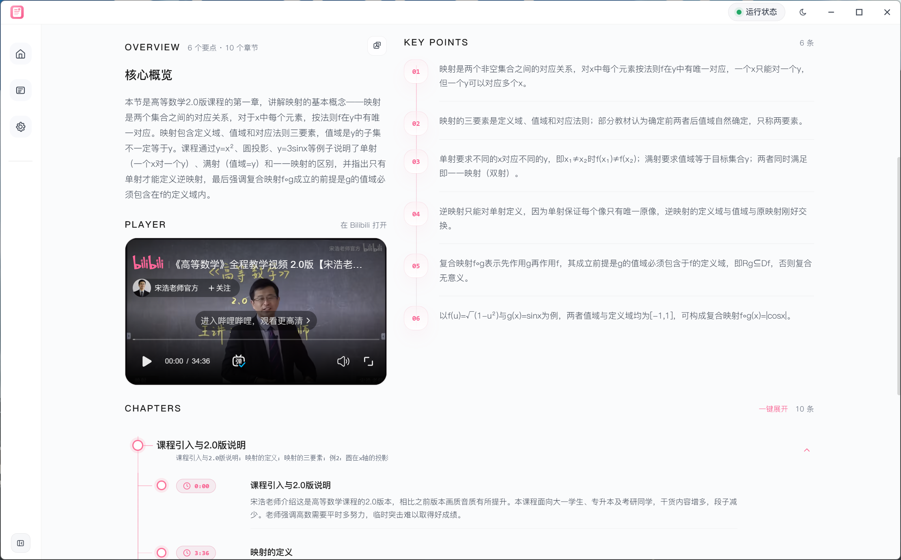
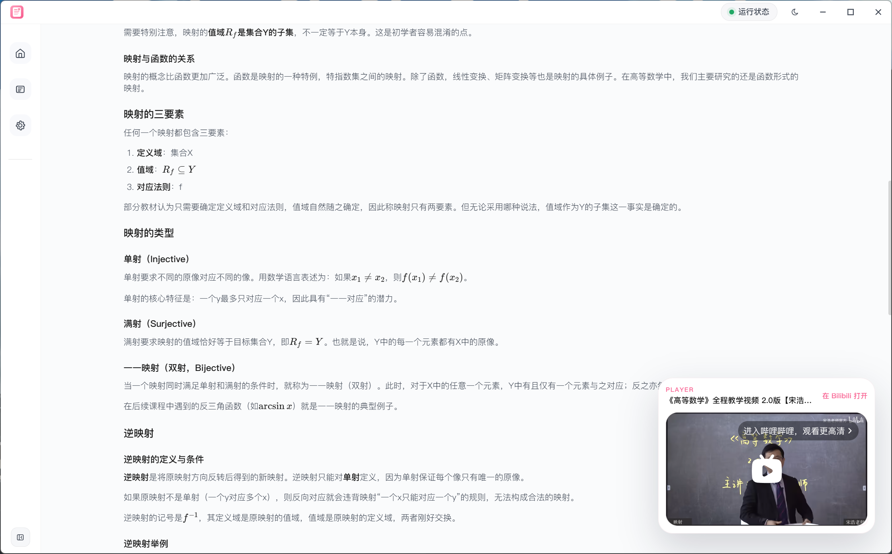
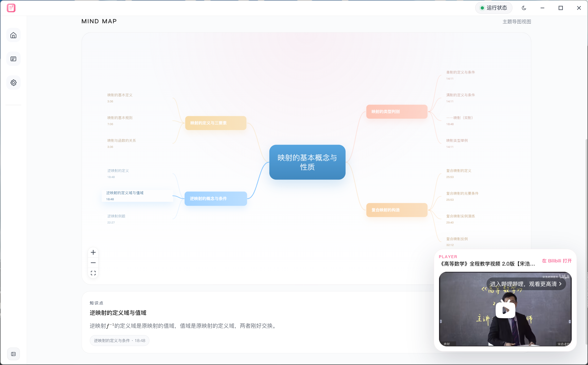
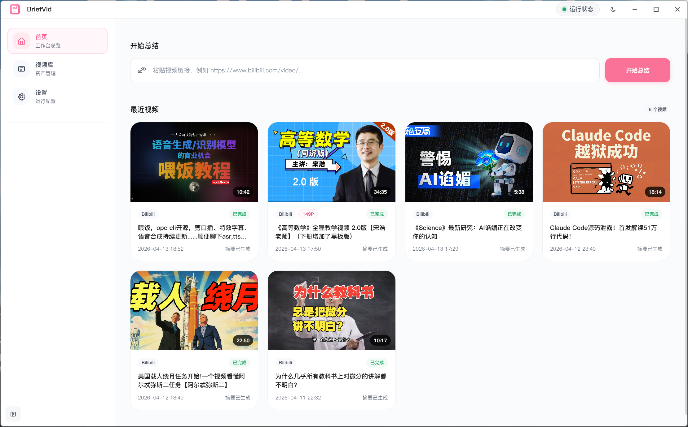

<div align="center">


**本地优先的视频知识工作台**

[](https://www.python.org/downloads/)
[](https://opensource.org/licenses/MIT)
[](#)

[快速开始](#-快速开始) · [产品特性](#-产品特性) · [技术栈](#️-技术栈) · [贡献指南](#-贡献指南)

</div>

---

> 输入一个 B 站视频链接，收获的不仅是字幕和摘要，而是一套可回溯、可复用、可生长的知识体系。

## 🌟 为什么需要 BriefVid

市面上的视频转写工具不少，但大多止步于"把话说完"——丢给你一段 transcript，或者一段泛泛的摘要。

**BriefVid 想做得更多：**

- 📚 **不止是转写** —— 自动拆解章节、提炼要点，生成结构化的知识卡片
- 🗃️ **沉淀为资产** —— 每个视频都是一条可追溯的知识条目，附带完整任务历史
- 🔄 **可反复打磨** —— 转写不满意？重新跑。摘要不够好？换套模型再来
- 🏠 **本地优先** —— 数据落本地，隐私可控，断网也能用

## 📸 产品速览

### 知识卡片视图

<div align="center">
  
  <p><i>核心概览 + 关键要点 + 章节时间轴，三栏布局清晰呈现</i></p>
</div>

### 笔记视图

<div align="center">
  
  <p><i>完整转写内容，支持数学公式、代码块等富文本格式</i></p>
</div>

### 思维导图视图

<div align="center">
  
  <p><i>放射状知识网络，内容结构和逻辑脉络一目了然</i></p>
</div>

### 视频库首页

<div align="center">
  
  <p><i>统一管理已探测和已处理的视频</i></p>
</div>

## ✨ 产品特性

### 核心工作流

```
B 站链接 → 视频探测 → 下载/转写 → 结构化摘要 → 知识卡片
              ↓                              ↓
          元数据缓存                    可回溯的任务历史
```

### 亮点能力

- **🧠 智能摘要引擎**
  - 不只是压缩内容，而是提炼知识骨架
  - 自动识别视频中的核心论点、案例和结论
  - 支持重新生成摘要，换套模型换个视角

- **📈 思维导图视图** ✅
  - 把线性视频转换成放射状知识网络
  - 一眼看清内容结构和逻辑脉络
  - 支持缩放、拖拽、节点高亮互动

- **⚡ 学习效率倍增**
  - 1 小时视频 → 5 分钟快速掌握核心
  - 章节时间轴 + 关键句高亮，精准定位
  - 支持倍速浏览文字稿，比看字幕快 3 倍

- **🗃️ 可生长的知识库**
  - 每个视频都是一条结构化知识卡片
  - 支持标签分类、全文检索
  - 未来可接入 Obsidian / Logseq

- **📝 完整笔记视图**
  - 逐字稿全文展示，支持搜索定位
  - 数学公式、代码块自动格式化
  - 保留原始语境，方便深度复查

- **🔄 灵活重跑机制**
  - `重新生成摘要`：复用转写，只重跑 LLM
  - `重新转写`：从音频开始全部重来

- **📊 实时进度透视**
  - REST + SSE 双通道同步任务状态
  - 每个阶段在做什么，清清楚楚

- **📄 分 P 视频支持**
  - 自动检测多 P 视频，支持选择单个分 P 总结
  - 也可分别处理多个分 P，独立生成摘要

## 🛠️ 技术栈

| 模块 | 技术选型 |
|------|----------|
| 桌面端 | Electron + React + TypeScript + Vite |
| 后端服务 | FastAPI + SQLite |
| 视频下载 | yt-dlp |
| 语音转写 | SiliconFlow ASR / 本地 Whisper（可选） |
| 摘要生成 | OpenAI-compatible API / 本地规则降级 |
| 思维导图 | ReactFlow |
| 打包分发 | PyInstaller onedir + electron-builder |

## 🚀 快速开始

### 环境要求

- Python **3.12**
- Node.js **20+**
- Windows 环境体验最佳
- 可选：`ffmpeg`、CUDA（本地 ASR 加速）

### 安装依赖

```powershell
# 推荐：使用 uv
uv sync --python 3.12 --all-packages

# 安装前端依赖
npm install --prefix .\apps\desktop
```

### 配置环境变量

```powershell
Copy-Item .env.example .env
```

编辑 `.env`，填入你的 API Key：

```env
# 服务配置
VIDEO_SUM_HOST=127.0.0.1
VIDEO_SUM_PORT=3838

# 转写服务（SiliconFlow）
VIDEO_SUM_TRANSCRIPTION_PROVIDER=siliconflow
VIDEO_SUM_SILICONFLOW_ASR_BASE_URL=https://api.siliconflow.cn/v1
VIDEO_SUM_SILICONFLOW_ASR_MODEL=TeleAI/TeleSpeechASR
VIDEO_SUM_SILICONFLOW_ASR_API_KEY=your-siliconflow-api-key

# LLM 摘要（可选，支持任意 OpenAI-compatible 接口）
VIDEO_SUM_LLM_ENABLED=true
VIDEO_SUM_LLM_BASE_URL=https://api.siliconflow.cn/v1
VIDEO_SUM_LLM_MODEL=qwen-plus
VIDEO_SUM_LLM_API_KEY=your-llm-api-key
```

### 启动开发环境

```powershell
npm run dev
```

这条命令会同时拉起：
- Vite 渲染层
- Electron 桌面壳
- Python 后端服务

### 桌面端打包

```powershell
npm run package:win
```

## 📦 项目结构

```
bilibili_sum/
├── apps/
│   ├── desktop/       # Electron + React 桌面端
│   │   ├── src/
│   │   │   ├── pages/      # 页面组件（首页/视频库/详情页/设置）
│   │   │   ├── components/ # 通用 UI 组件
│   │   │   ├── api.ts      # API 客户端
│   │   │   └── appModel.ts # 状态管理
│   │   └── build/          # 构建产物
│   └── service/       # FastAPI 本地服务
│       └── src/
│           └── video_sum_service/
│               ├── app.py         # FastAPI 应用入口
│               ├── main.py        # 服务启动逻辑
│               ├── worker.py      # 后台任务执行器
│               ├── repository.py  # SQLite 数据持久化
│               └── schemas.py     # API 数据模型
├── packages/
│   ├── core/          # 下载、转写、摘要核心逻辑
│   │   └── src/video_sum_core/
│   │       ├── pipeline/   # 流程编排
│   │       └── models/     # 领域模型
│   └── infra/         # 配置、运行时、基础设施
│       └── src/video_sum_infra/
│           ├── config/   # 配置管理
│           └── runtime/  # 运行时引导
├── docs/pic/          # 文档资源
├── scripts/           # PowerShell 工具脚本
├── build/pyinstaller/ # PyInstaller 打包配置
└── .env.example       # 环境变量模板
```

## 🤝 贡献指南

欢迎以任意方式参与 BriefVid 的成长：

### 你可以贡献什么

- 🐛 **提交 Issue**：遇到 Bug 或有功能建议，直接开 Issue
- 🔧 **提交 PR**：修复 Bug、新增功能、优化体验均可
- 📝 **完善文档**：补充使用说明、优化文案、增加示例
- 💡 **分享用例**：在你的工作流中使用 BriefVid，欢迎分享经验


### 代码风格

- Python：遵循 PEP 8，类型注解优先
- TypeScript：严格模式，React 组件使用函数式写法
- Commit 信息：参考 [Conventional Commits](https://www.conventionalcommits.org/)

## 🔮 路线图

- [x] 思维导图视图
- [ ] 更多视频平台支持（YouTube、本地文件）
- [ ] 知识卡片导出为 Markdown / Notion
- [ ] 与 Obsidian / Logseq 等知识管理工具集成
- [x] GPU 运行时一键安装与管理

## 📄 License

MIT License © 2026 Lycohana


<div align="center">
  <sub>Built with ❤️ by Lycohana</sub>
</div>
