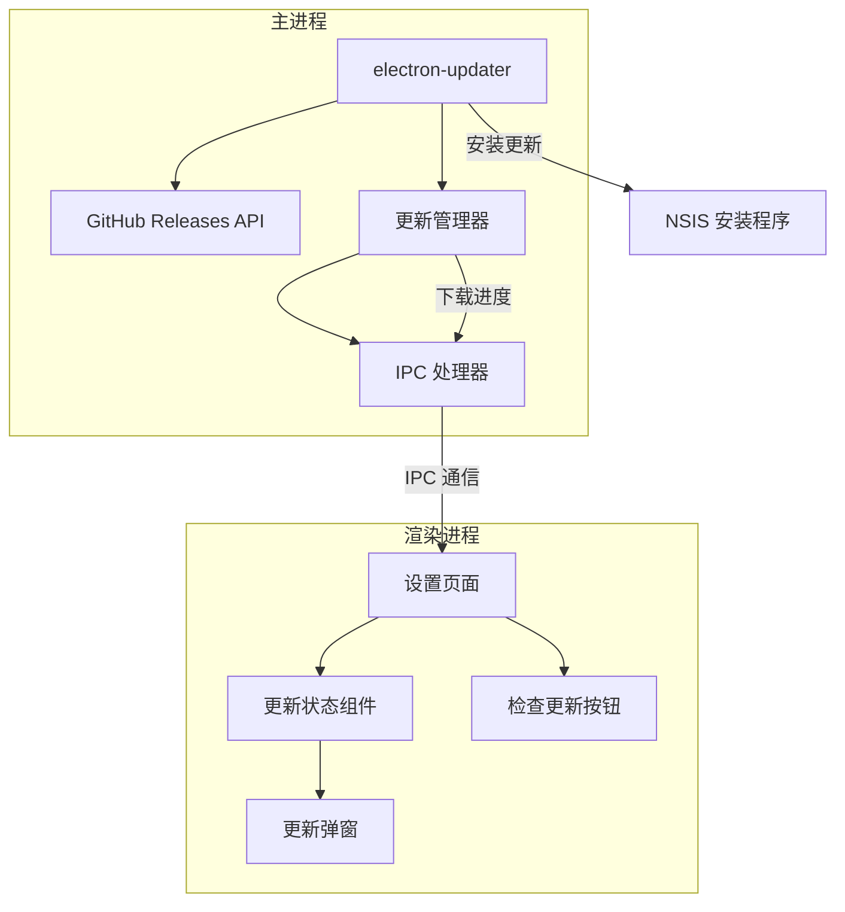
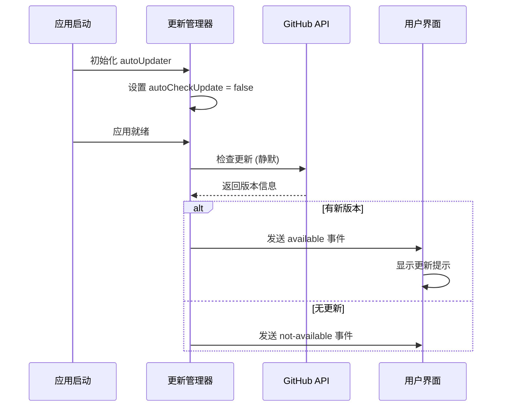
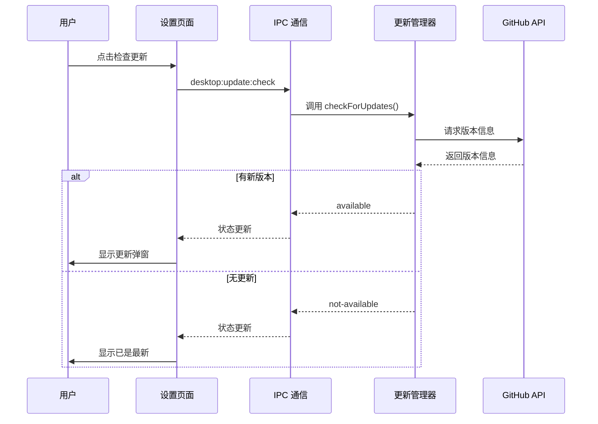
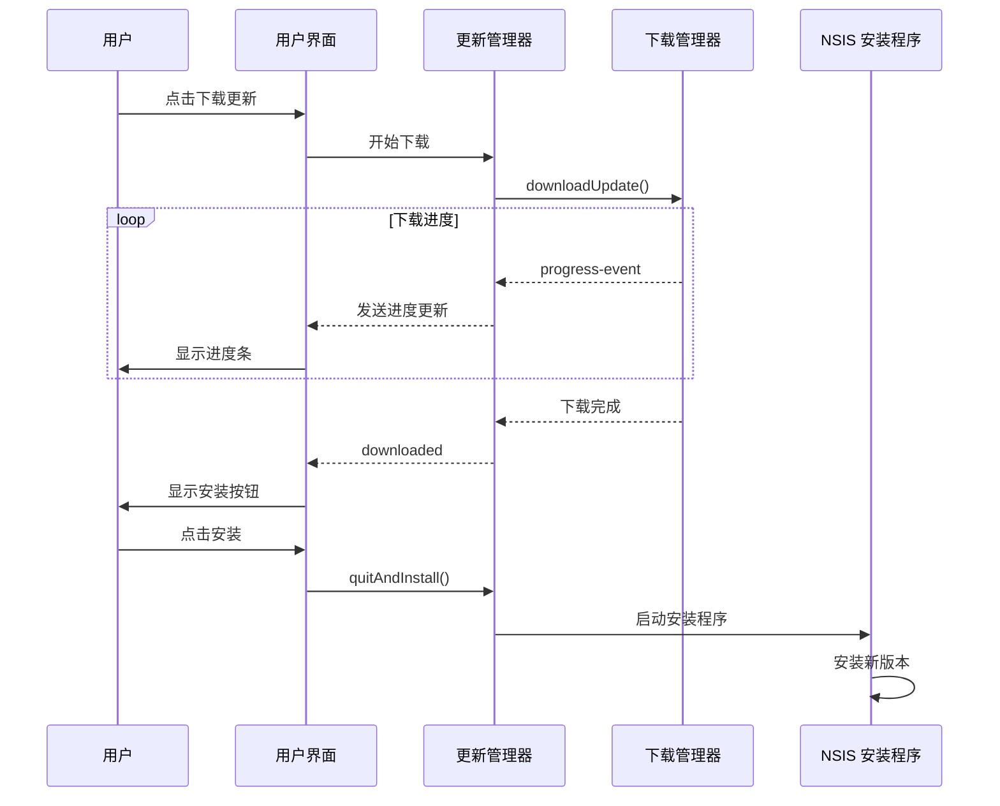

# BriefVid 更新系统设计文档

## 概述

本设计文档描述了 BriefVid 桌面应用的自动更新系统，该系统从 GitHub Releases 获取最新版本信息，支持自动下载和安装更新。

## 系统架构



## 核心组件

### 1. electron-updater 配置

使用 `electron-updater` 库实现自动更新功能，该库支持：
- GitHub Releases 作为更新源
- NSIS 安装程序集成
- 自动下载和安装
- 更新前提示用户

### 2. 更新管理器 (UpdateManager)

位于 [`electron/main.ts`](apps/desktop/electron/main.ts)，负责：
- 初始化 autoUpdater
- 监听更新事件
- 管理更新状态
- 通过 IPC 向渲染进程发送状态更新

### 3. IPC 通信接口

#### 新增 IPC 处理器

| IPC Channel | 方向 | 描述 |
|-------------|------|------|
| `desktop:update:check` | 渲染→主进程 | 手动触发更新检查 |
| `desktop:update:download` | 渲染→主进程 | 开始下载更新 |
| `desktop:update:install` | 渲染→主进程 | 安装已下载的更新 |
| `desktop:update:get-status` | 渲染→主进程 | 获取当前更新状态 |
| `desktop:update:status-changed` | 主进程→渲染 | 更新状态变化事件 |

#### 更新状态类型

```typescript
type UpdateStatus = 
  | "idle"              // 无操作
  | "checking"          // 正在检查
  | "available"         // 有可用更新
  | "not-available"     // 已是最新版本
  | "downloading"       // 正在下载
  | "downloaded"        // 下载完成
  | "error"             // 发生错误;

type UpdateInfo = {
  version: string;
  releaseDate: string;
  releaseNotes: string | null;
  downloadProgress: number; // 0-100
};
```

### 4. 用户界面

#### 设置页面更新区域

在设置页面添加"关于与更新"区域，包含：
- 当前版本号
- 自动更新开关
- 检查更新按钮
- 更新状态指示器
- 更新日志预览

#### 更新弹窗

当发现新版本时显示模态弹窗，包含：
- 新版本号
- 发布日期
- 更新日志
- 下载/安装按钮
- 稍后提醒选项

## 工作流程

### 启动时检查更新



### 手动检查更新



### 下载和安装更新



## 配置要求

### electron-builder 配置

需要在 [`electron-builder.config.js`](apps/desktop/electron-builder.config.js) 中添加：

```javascript
{
  publish: {
    provider: "github",
    owner: "lycohana",
    repo: "BriefVid",
    releaseType: "release"
  }
}
```

### package.json 依赖

需要添加：
```json
{
  "dependencies": {
    "electron-updater": "^6.3.0"
  }
}
```

## 文件变更清单

| 文件 | 变更类型 | 描述 |
|------|----------|------|
| `apps/desktop/package.json` | 修改 | 添加 electron-updater 依赖 |
| `apps/desktop/electron-builder.config.js` | 修改 | 添加 publish 配置 |
| `apps/desktop/electron/main.ts` | 修改 | 添加更新管理器和 IPC 处理器 |
| `apps/desktop/electron/preload.ts` | 修改 | 暴露更新 API |
| `apps/desktop/src/desktop.d.ts` | 修改 | 添加更新相关类型定义 |
| `apps/desktop/src/App.tsx` | 修改 | 添加更新状态显示 |
| `apps/desktop/src/components/UpdateDialog.tsx` | 新建 | 更新弹窗组件 |
| `apps/web/static/js/views/settings.js` | 修改 | 添加更新设置 UI |

## 安全考虑

1. **代码签名**: 虽然当前禁用了代码签名，但更新系统依赖文件哈希验证
2. **HTTPS**: GitHub Releases API 使用 HTTPS，确保传输安全
3. **版本验证**: electron-updater 会验证 release 的资产完整性

## 后续扩展

1. **增量更新**: 支持 differential updates 减少下载量
2. **预发布版本**: 支持 opt-in 到 beta 通道
3. **更新历史**: 记录更新历史便于问题排查
4. **企业部署**: 支持私有更新服务器
